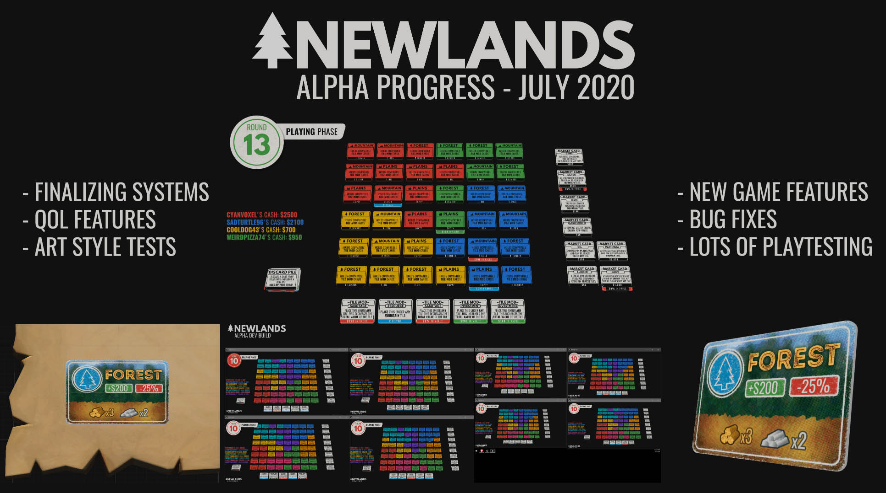

# Newlands
### *A digital tabletop game about staking your claim in an unknown territory! By making strategic investments, devious sabotages, and a little bit of market manipulating, you could be the next land baron billionaire!*

## Game Synopsis
Newlands is played in two main phases. During the "Buying" phase, players take turns buying tiles, the contents of which are unknown and shuffled. After initial tiles have been bought, players can then only buy tiles adjacent to those they already own. Once all tiles are purchased, the "Playing" phase begins.

The main gameplay of Newlands revolves around trying to balance maximizing the number of resources on your land, sabotaging other player's land, and manipulating the market to swing in your favor. So how does this work? The tiles a player owns can only support certain resources. Most tiles even come with their own resources embedded in them, and valuable ones if you're lucky! By playing modifier cards that add resources on to tiles, you can quickly increase your cash total! The catch, however, is that a resource's value isn't set in stone. Players can also play modifier cards on the resource market, and can quickly make the price of all that gold you found plummet! The idea of the game is the need to balance the types of tiles you've got with the resources that work with it, diversify your investments as much as you can, play the market in your favor, and sabotage other players to make sure they don't come out on top!

## Progress Report: July 2020

With all of the previous new systems up and running, progress in the Alpha builds has been building very quickly! I'm currently working on listening to player and playtest feedback, putting final touches on core systems, and developing the final art style for the Beta.

## July Alpha Progress:

#### Features:
- [x] Usernames can be entered upon joining a match to be displayed in-game
- [x] Card rules have changed slightly, only allowing "positive" cards to be played on your own tiles, and "negative" cards on other's tiles
- [x] Better camera movement via right/middle-click and drag, as well as camera bounds
- [x] A new Discard Pile allows player to throw away an unwanted card for their turn
- [ ] Player Lobby + Ready-Up system
- [ ] "Pause" Menu

#### Improvements:
- [x] Join/Host screens are now separate, only containing relevant info
- [x] A winner is now calculated when all cards are played, and players can return to the main menu

#### Bug Fixes:
- Market system and resource calculations working again after refactor
- ame data is reset upon exiting a match, no longer requiring a game restart

#### Experimental:
- Dualshock controller camera movement
- 8-Player mode support

#### Goals for the Future (Beta and Beyond):
- Dress up the game grid with a magically-expanding table and props that play into the "tabletop" design
- Create a final main menu that plays both into the tabletop design as well as cartographer look. I have plenty of ideas for a nice smoothly transitioning menu setup where you feel like you're moving to different ends of a table filled with maps and tools, but this will have to wait!
- Probably a different method of looking at your own cards as well as the market cards
- Tiles will be rendered differently at a distance to give more intuitive information at a glance, such as being color-coded with their type instead of owner, as well as contain icons for what resources they contain.
- Nicer final animations, especially for flipping cards
- Coast Tiles and a Fish Resource! These tiles will appear only on the edge of the grid, and will (hopefully) create interesting conflicts when choosing which tiles to purchase during the first phase
- Sound effects, and possibly a soundtrack?
- And more!

## Thanks for checking in on the progress of Newlands!
